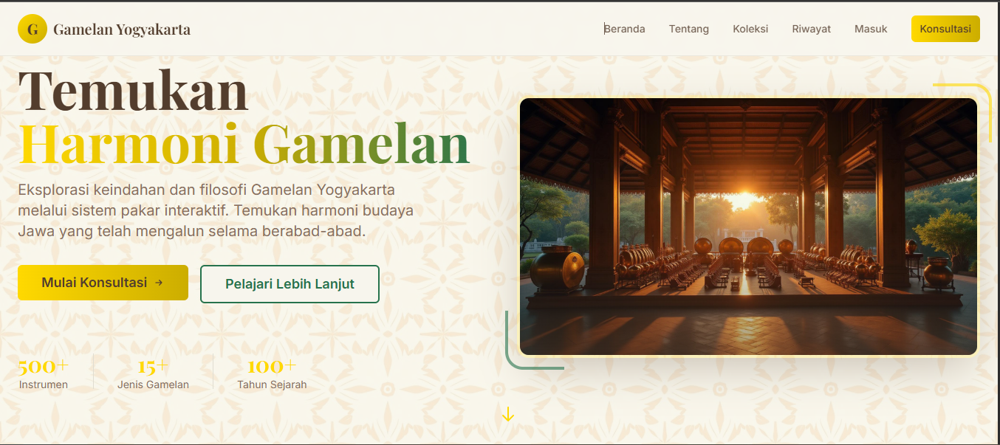

# 🎵 Sistem Pakar: Gamelan Harmony


### App Screenshot



> **"Menyatu dengan Irama, Menjaga Warisan Budaya."**
> Sistem Pakar Berbasis Website untuk Rekomendasi Objek Wisata Budaya Musik Gamelan di Lingkungan Kraton Yogyakarta.

---

## 📑 Daftar Isi
1. [Tentang Proyek](#-tentang-proyek)
2. [Latar Belakang Masalah](#-latar-belakang-masalah)
3. [Tim Pengembang](#-tim-pengembang-kelompok-8)
4. [Metode & Algoritma](#-metode--algoritma-certainty-factor)
5. [Basis Pengetahuan (Knowledge Base)](#-basis-pengetahuan-knowledge-base)
6. [Fitur Aplikasi](#-fitur-unggulan)
7. [Teknologi](#-teknologi-tech-stack)
8. [Instalasi & Penggunaan](#-instalasi--penggunaan)

---

## 📖 Tentang Proyek

[cite_start]**Gamelan Harmony** adalah aplikasi web cerdas yang dibangun untuk memenuhi tugas mata kuliah **Sistem Pakar** di **Universitas Putra Bangsa** (Semester Ganjil T.A 2024/2025)[cite: 10, 12].

Aplikasi ini berfungsi sebagai pemandu wisata digital yang cerdas. Berbeda dengan website wisata biasa, sistem ini memiliki "otak" (inference engine) yang mampu meniru kemampuan pengambilan keputusan seorang pakar budaya. [cite_start]Sistem akan menganalisis preferensi pengguna dan memberikan rekomendasi objek wisata gamelan yang paling *compatible* dengan minat mereka[cite: 21, 22].

## 🚩 Latar Belakang Masalah

[cite_start]Yogyakarta, khususnya area **Kraton (Karaton Ngayogyakarta Hadiningrat)**, memiliki kekayaan wisata gamelan yang luar biasa[cite: 16]. Namun, wisatawan sering menghadapi masalah:

1.  [cite_start]**Asimetri Informasi:** Banyaknya pilihan objek (Pagelaran, Museum, Latihan, dll) membuat wisatawan bingung[cite: 19].
2.  [cite_start]**Ketidakcocokan:** Wisatawan sering mengunjungi tempat yang tidak sesuai dengan waktu yang mereka miliki atau tujuan mereka (misal: ingin belajar, tapi datang ke tempat yang hanya untuk menonton)[cite: 20].
3.  **Inefisiensi:** Sulit menentukan jadwal tanpa pengetahuan lokal.

[cite_start]Sistem ini hadir untuk menjembatani kesenjangan tersebut dengan memberikan rekomendasi yang terpersonalisasi berdasarkan **Tujuan (Gejala)**, **Waktu Kunjungan (Hari)**, dan **Durasi**[cite: 19].

---

## 👥 Tim Pengembang (Kelompok 8)

[cite_start]Proyek ini dikembangkan oleh mahasiswa Sarjana Ilmu Komputer / Sains Data Fakultas Sains & Teknologi[cite: 7, 11]:

| No | Nama Mahasiswa | NIM | Peran Tim |
|----|----------------|-----|-----------|
| 1 | **Eriqho Firdaus** | 230202747 | Project Manager & Logic, Jurnal |
| 2 | **Favian Rizki Febriansyah** | 230202750 | UI/UX Designer |
| 3 | **Mochamad Ilham Hansyil** | 230202767 | Data Analyst, programing, Konfigurasi DataBase |
| 4 | **Muhammad Farhan Alrafi** | 230202816 | Jurnal |
| 5 | **Ratna Rizka Maharani** | 230202778 | PPT Jurnal |

---

## 🧠 Metode & Algoritma: Certainty Factor

Sistem ini menggunakan metode **Certainty Factor (CF)** untuk menangani ketidakpastian. [cite_start]Preferensi wisatawan tidak selalu hitam-putih, sehingga CF digunakan untuk memberikan nilai "keyakinan" pada setiap rekomendasi[cite: 51, 52].

### Logika Perhitungan
[cite_start]Mesin inferensi bekerja dengan strategi **Forward Chaining**[cite: 59]. Nilai CF dihitung menggunakan kombinasi aturan `AND` (mengambil nilai minimum dari premis yang terpenuhi).

**Rumus Dasar:**
$$CF(Rule) = min(CF_{user}(gejala) * CF_{pakar}(rule))$$

Dalam implementasi sistem ini, karena input user bersifat biner (dipilih/tidak), maka logika penyederhanaannya adalah:
$$CF_{Total} = min(Bobot_{Gejala}, Bobot_{Hari}, Bobot_{Durasi})$$

**Skala Keyakinan Pakar:**
* [cite_start]**1.0:** Mutlak / Sangat Pasti (Wajib ada) [cite: 55]
* [cite_start]**0.8:** Hampir Pasti (Sangat Penting) [cite: 55]
* [cite_start]**0.6:** Kemungkinan Besar (Cukup Mendukung) [cite: 56]
* [cite_start]**0.4:** Mungkin (Sedikit Mendukung) [cite: 57]

---

## 📚 Basis Pengetahuan (Knowledge Base)

Sistem dibangun berdasarkan data pakar yang dipetakan ke dalam kode-kode berikut:

### [cite_start]1. Data Hasil Pakar (Output) [cite: 85]
* **H01:** Pagelaran Gamelan Bangsal Sri Menganti
* **H02:** Museum Keraton (Koleksi Instrumen)
* **H03:** Latihan Gamelan (Live Practice)
* **H04:** Sanggar Belajar Gamelan (Hands-on)
* **H05:** Tempat Perawatan / Konservasi

### 2. Data Gejala & Fakta (Input)
Pengguna diminta memasukkan input berdasarkan 3 kategori:
* [cite_start]**Tujuan (G):** Menonton (G01), Belajar (G02), Sejarah (G03), Melihat Proses (G04)[cite: 90].
* [cite_start]**Waktu (I):** Pagi (I01), Siang (I02), Malam (I03)[cite: 92].
* [cite_start]**Durasi (J):** Singkat <1 jam (J01), Sedang 1-2 jam (J02), Lama >2 jam (J03)[cite: 94].

### [cite_start]3. Contoh Aturan (Rule Base) [cite: 99]
Sistem mengevaluasi 10+ aturan, contohnya:
* **Rule 1:** `IF` Menonton (G01) `AND` Pagi (I01) `AND` Durasi Sedang (J02) `THEN` Pagelaran (H01) `WITH CF` 0.6.
* **Rule 5:** `IF` Belajar (G02) `AND` Durasi Lama (J03) `AND` Pagi (I01) `THEN` Sanggar Belajar (H04).

---

## 🚀 Fitur Unggulan

Aplikasi ini telah dikembangkan menjadi *Modern Web Application* dengan fitur lengkap:

### 1. 🔐 Autentikasi Pengguna (Login & Register)
* Desain **Split-Screen** yang elegan: Setengah layar menampilkan visual artistik Gamelan, setengahnya formulir.
* Mendukung **Social Login** (Simulasi UI): Google, Facebook, Twitter, dan Apple.
* Validasi form yang aman dan responsif.

### 2. 🤖 Konsultasi Cerdas
* Antarmuka kuesioner interaktif (Step-by-step wizard).
* Menghitung skor kecocokan secara *real-time*.
* Menampilkan hasil dengan persentase akurasi (misal: "Kecocokan 80%").

### 3. 📜 Riwayat Konsultasi (History)
* Menggunakan **LocalStorage** Browser untuk menyimpan sesi pengguna.
* Memungkinkan pengguna melihat kembali rekomendasi masa lalu tanpa login ulang.
* Tampilan kartu riwayat dengan aksen emas yang mewah.

### 4. 🏛️ Galeri Koleksi & Detail
* Katalog lengkap 5 destinasi wisata gamelan.
* **Modal Pop-up Detail:** Menampilkan informasi mendalam (Jadwal, Lokasi, Deskripsi Sejarah) tanpa perlu reload halaman.

### 5. 🎨 Desain UI/UX Berbudaya
* Tema warna **Keraton Yogyakarta**: *Royal Gold* (#FFD700), *Deep Emerald Green*, dan Coklat Kayu.
* Ornamen latar belakang bermotif **Batik Parang** dan **Kawung**.
* Tipografi Serif yang elegan dipadukan dengan layout modern yang bersih.

---

## 🛠️ Teknologi (Tech Stack)

Proyek ini dibangun menggunakan ekosistem JavaScript modern untuk performa tinggi:

* **Frontend Framework:** React 18 (Component-based architecture)
* **Language:** TypeScript (Strict type checking untuk keamanan logika pakar)
* **Build Tool:** Vite (Super fast bundling)
* **Styling Engine:** Tailwind CSS (Utility-first styling)
* **UI Library:** shadcn-ui (Komponen UI yang aksesibel dan kustomizable)
* **Icons:** Lucide React
* **AI Assistant:** Lovable.dev (Accelerated development)

---

## 💻 Instalasi & Penggunaan

Ikuti langkah-langkah berikut untuk menjalankan proyek di lingkungan lokal (Localhost):

### Prasyarat
* Node.js (Versi 16 atau lebih baru)
* npm atau yarn

### Langkah Instalasi

1.  **Clone Repository**
    Buka terminal dan jalankan perintah:
    ```bash
    git clone [https://github.com/username-anda/gamelan-harmony.git](https://github.com/username-anda/gamelan-harmony.git)
    ```

2.  **Masuk ke Direktori Proyek**
    ```bash
    cd gamelan-harmony
    ```

3.  **Install Dependencies**
    Mengunduh semua pustaka yang dibutuhkan:
    ```bash
    npm install
    ```

4.  **Jalankan Server Development**
    Memulai server lokal dengan fitur *Hot-Reload*:
    ```bash
    npm run dev
    ```

5.  **Akses Aplikasi**
    Buka browser Anda dan kunjungi URL yang muncul di terminal (biasanya `http://localhost:8080`).

---

### Catatan Pengembangan
Jika Anda ingin mengubah aturan pakar (Rule Base), silakan edit file `src/utils/expertLogic.ts`. Struktur data dirancang modular agar mudah ditambahkan aturan baru tanpa merusak tampilan antarmuka.

---

**© 2025 Kelompok 8 - Universitas Putra Bangsa**
*Dibuat dengan bangga untuk melestarikan budaya Indonesia melalui teknologi.*